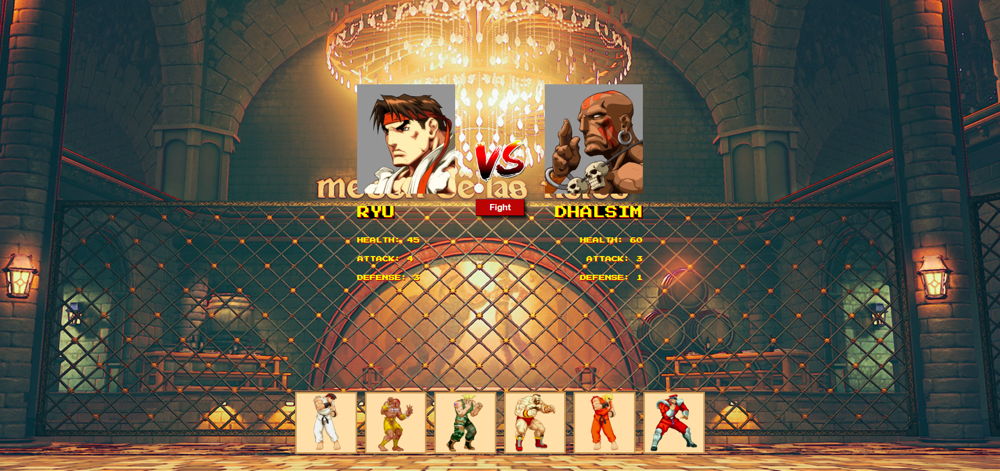
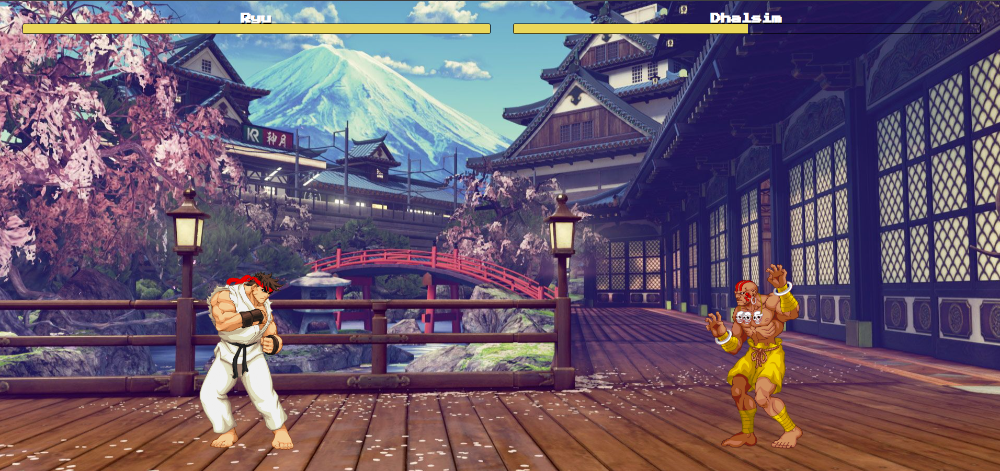

# Fighting Game

A dynamic browser-based two-player fighting game built using JavaScript, Node.js, and HTML. The game features real-time combat, responsive controls, and engaging graphics to provide an exciting gaming experience.

## 🏃‍♂️ Simple Start

1. **`npm run setup`** at the root
2. **`npm run dev`** at the root
3. Open **`http://localhost:7600/`**

OR

1. **`npm i`** at the root
2. **`npx simple-git-hooks`** at the root
3. **`npm run dev`** at the root
4. Open **`http://localhost:7600/`**

## Features

- Real-time combat
- Responsive controls
- Engaging graphics

